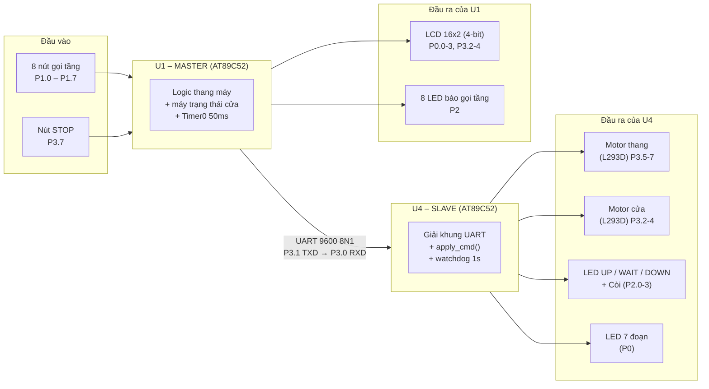
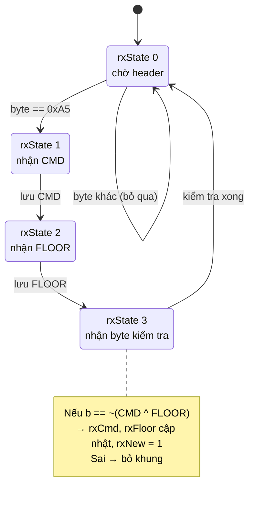
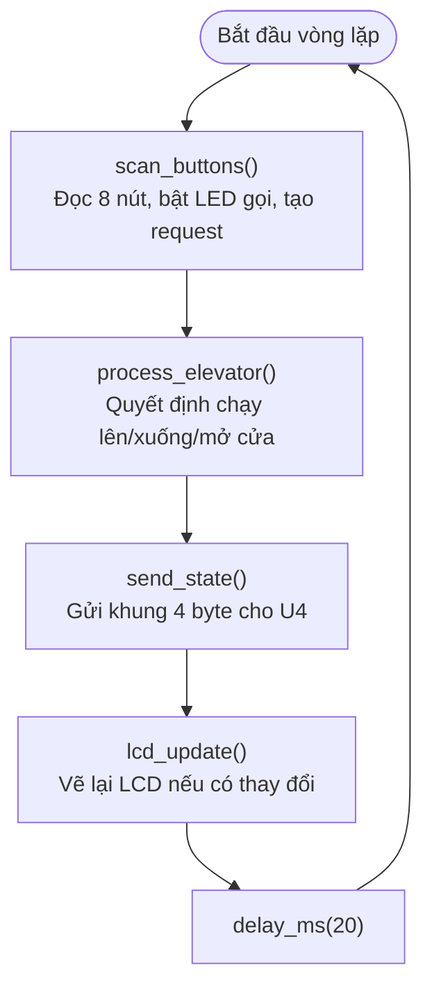
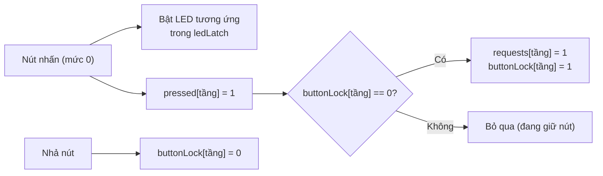
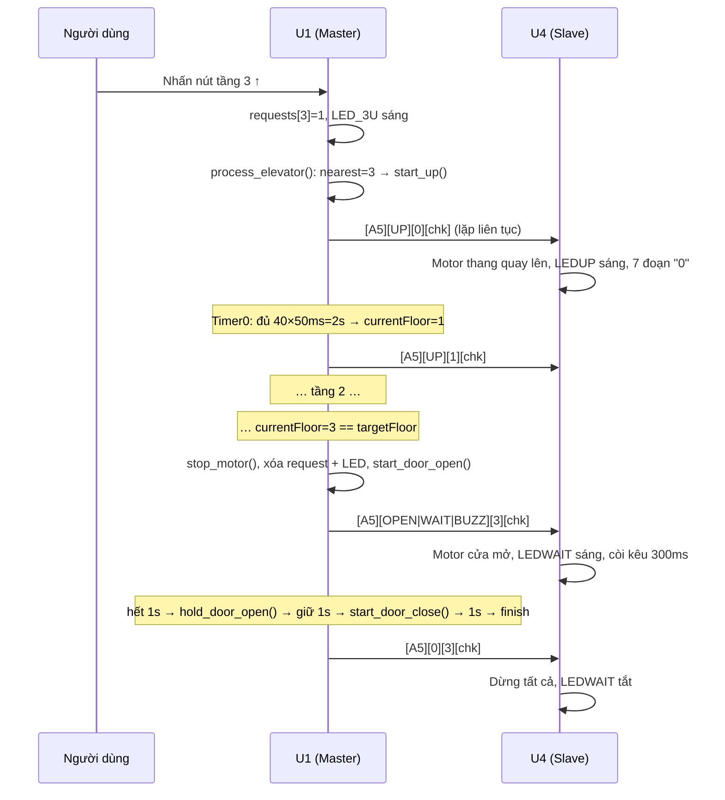
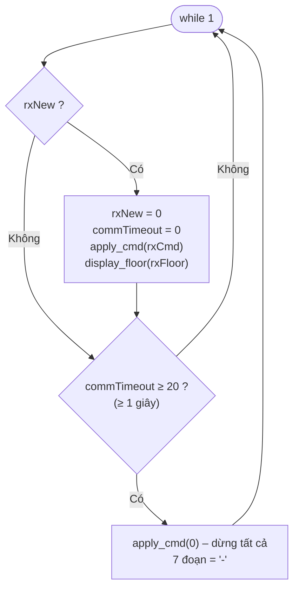
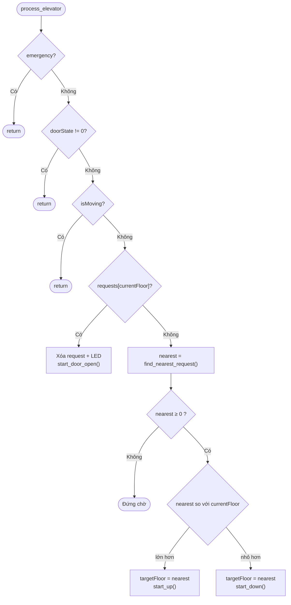
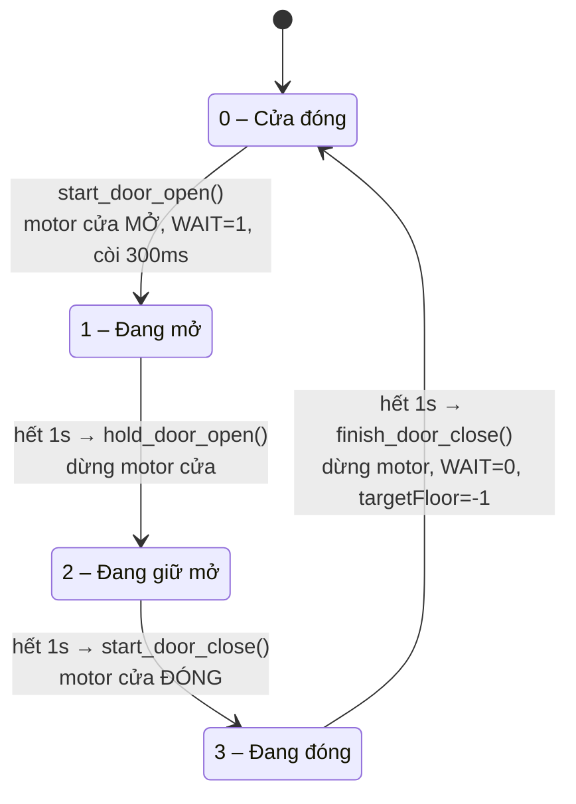

# 🛗 Thang máy 5 điểm dừng (Tầng 0 → 4) – 2 vi điều khiển AT89C52 giao tiếp UART

> Đồ án môn **Hệ thống nhúng** – Nhóm 5 (Proteus + Keil µVision, ngôn ngữ C cho 8051).

Hệ thống mô phỏng một thang máy phục vụ **5 tầng (0, 1, 2, 3, 4)**. Chức năng được chia cho **hai vi điều khiển AT89C52** làm việc theo mô hình **Master – Slave**, nối với nhau bằng **UART một chiều (9600 baud)**:

| Vi điều khiển | Vai trò | File nguồn | Project Keil | File HEX |
|---|---|---|---|---|
| **U1 – Master** | "Bộ não": đọc nút, xử lý logic thang máy, điều phối cửa, hiển thị LCD, gửi lệnh | `U1_master.c` | `MCU1.uvproj` | `MCU1.hex` |
| **U4 – Slave** | "Chấp hành": nhận lệnh, điều khiển motor thang/cửa, LED, còi, LED 7 đoạn | `U4_slave.c` | `MCU2.uvproj` | `MCU2.hex` |

---

## Mục lục

1. [Tính năng](#1-tính-năng)
2. [Cấu trúc thư mục](#2-cấu-trúc-thư-mục)
3. [Kiến trúc tổng thể](#3-kiến-trúc-tổng-thể)
4. [Sơ đồ nối chân](#4-sơ-đồ-nối-chân)
5. [Giao thức UART U1 → U4](#5-giao-thức-uart-u1--u4)
6. [Luồng hoạt động của U1 (Master)](#6-luồng-hoạt-động-của-u1-master)
7. [Luồng hoạt động của U4 (Slave)](#7-luồng-hoạt-động-của-u4-slave)
8. [Thuật toán điều phối thang](#8-thuật-toán-điều-phối-thang)
9. [Máy trạng thái cửa](#9-máy-trạng-thái-cửa)
10. [Dừng khẩn cấp](#10-dừng-khẩn-cấp)
11. [Màn hình LCD](#11-màn-hình-lcd)
12. [Thông số thời gian](#12-thông-số-thời-gian)
13. [Hướng dẫn build & chạy mô phỏng](#13-hướng-dẫn-build--chạy-mô-phỏng)
14. [Kịch bản kiểm thử](#14-kịch-bản-kiểm-thử)
15. [Lưu ý & hướng phát triển](#15-lưu-ý--hướng-phát-triển)

---

## 1. Tính năng

- Gọi thang từ **8 nút gọi tầng** (tầng 0 chỉ có nút ↑, tầng 4 chỉ có nút ↓, tầng 1–3 có cả ↑ và ↓).
- **LED báo đã gọi** cho từng nút, tự tắt khi thang phục vụ xong tầng đó.
- Thuật toán chọn **tầng yêu cầu gần nhất**; nếu đi ngang qua tầng khác đang có yêu cầu thì **dừng lại phục vụ luôn**.
- **Cửa thang** mở – giữ – đóng tự động, có LED `WAIT` và **còi** báo khi tới tầng.
- **LCD 16x2 (4-bit)** hiển thị tầng hiện tại và trạng thái (sẵn sàng / đi lên / đi xuống / mở cửa / mời vào thang / đóng cửa / dừng khẩn cấp).
- **LED 7 đoạn** (ở U4) hiển thị số tầng.
- **Nút STOP khẩn cấp**: dừng ngay motor, còi kêu liên tục; nhả nút thì tiếp tục đúng trạng thái đang dở.
- **Watchdog truyền thông**: U4 mất khung lệnh từ U1 quá 1 giây → tắt toàn bộ đầu ra, LED 7 đoạn hiện dấu `-`.
- **Chống lặp phím** (`buttonLock`): giữ nút không sinh nhiều yêu cầu.
- **Khung UART có byte kiểm tra** để loại nhiễu.

---

## 2. Cấu trúc thư mục

```
Project/
├── U1_master.c            # Mã nguồn MASTER (U1) – dùng cho MCU1
├── U4_slave.c             # Mã nguồn SLAVE  (U4) – dùng cho MCU2
│
├── MCU1.uvproj            # Project Keil cho U1 (AT89C52)  → MCU1.hex
├── MCU2.uvproj            # Project Keil cho U4 (AT89F52)  → MCU2.hex
├── MCU1.hex / MCU2.hex    # Firmware nạp vào 2 chip trong Proteus
│
├── project Group5 .pdsprj # Sơ đồ mạch Proteus (2× AT89C52, LCD, L293D, LED 7 đoạn, motor…)
├── Project Backups/       # Các bản sao lưu tự động của Proteus
│
└── *.LST, *.OBJ, *.M51, *.lnp, *.plg, *.uvopt, *.uvgui*   # File sinh ra khi build/lưu workspace
```

> Kết quả build gần nhất: **MCU1** – code = 1750 byte, data = 34.2 byte; **MCU2** – code = 501 byte, data = 15.1 byte. Cả hai: 0 lỗi, 0 cảnh báo.

---

## 3. Kiến trúc tổng thể



**Nguyên tắc phân chia:** U1 giữ **toàn bộ trạng thái** (tầng hiện tại, tầng đích, request, trạng thái cửa…). U4 **không tự quyết định gì** – chỉ nhận một byte lệnh `outCmd` + số tầng rồi xuất ra chân tương ứng. Vì vậy U4 luôn "đồng bộ" theo U1, và nếu U1 hỏng thì U4 tự dừng an toàn.

---

## 4. Sơ đồ nối chân

### 4.1. U1 – Master

| Chân | Chức năng | Ghi chú |
|---|---|---|
| **P0.0 – P0.3** | LCD D4 – D7 | Có điện trở kéo lên; các bit cao P0.4–P0.7 để mức 1 |
| **P3.2 / P3.3 / P3.4** | LCD RS / RW / E | RW luôn = 0 (chỉ ghi, không đọc busy flag) |
| **P1.7** | Nút gọi tầng 0 ↑ (`BTN0U`) | Active-low |
| **P1.6 / P1.5** | Nút tầng 1 ↓ / ↑ | |
| **P1.4 / P1.3** | Nút tầng 2 ↓ / ↑ | |
| **P1.2 / P1.1** | Nút tầng 3 ↓ / ↑ | |
| **P1.0** | Nút tầng 4 ↓ (`BTN4`) | |
| **P2.0 – P2.7** | 8 LED báo đã gọi tầng | Mức 1 = sáng (LED nối xuống GND) |
| **P3.7** | Nút **STOP** khẩn cấp | Active-low (kéo lên 10 kΩ khi làm mạch thật) |
| **P3.1 (TXD)** | Gửi UART → U4 | |

Ánh xạ LED ↔ nút (P2):

| Bit P2 | LED | Sáng khi nhấn |
|---|---|---|
| P2.0 | `LED_4D` | Nút tầng 4 ↓ (P1.0) |
| P2.1 | `LED_3D` | Nút tầng 3 ↓ (P1.2) |
| P2.2 | `LED_2D` | Nút tầng 2 ↓ (P1.4) |
| P2.3 | `LED_1D` | Nút tầng 1 ↓ (P1.6) |
| P2.4 | `LED_3U` | Nút tầng 3 ↑ (P1.1) |
| P2.5 | `LED_2U` | Nút tầng 2 ↑ (P1.3) |
| P2.6 | `LED_1U` | Nút tầng 1 ↑ (P1.5) |
| P2.7 | `LED_0U` | Nút tầng 0 ↑ (P1.7) |

### 4.2. U4 – Slave

| Chân | Chức năng | Ghi chú |
|---|---|---|
| **P0.0 – P0.6** | LED 7 đoạn a…g | **Common anode** (mức 0 = sáng) |
| **P2.0** | `LEDUP` | Sáng khi thang đi lên |
| **P2.1** | `LEDWAIT` | Sáng khi cửa đang mở/giữ/đóng |
| **P2.2** | `LEDDOWN` | Sáng khi thang đi xuống |
| **P2.3** | `BUZZ` | Còi |
| **P3.2 / P3.3 / P3.4** | Motor cửa: `IN1` (mở) / `IN2` (đóng) / `EN` | Qua L293D |
| **P3.5 / P3.6 / P3.7** | Motor thang: `IN1` (lên) / `IN2` (xuống) / `EN` | Qua L293D |
| **P3.0 (RXD)** | Nhận UART từ U1 | |

### 4.3. Linh kiện trong sơ đồ Proteus (`project Group5 .pdsprj`)

- 2 × **AT89C52** (nạp `MCU1.hex` và `MCU2.hex`)
- 1 × **LM016L** (LCD 16x2)
- **L293D** (điều khiển motor thang và motor cửa) + 2 × **MOTOR**
- 1 × **7SEG-COM-ANODE**
- **LED-RED / LED-G** (LED báo gọi, UP, DOWN, WAIT), **BUZZER**, **BUTTON**, điện trở

> Thạch anh cả hai chip: **11.0592 MHz**.

---

## 5. Giao thức UART U1 → U4

- **Cấu hình:** Timer 1 chế độ 2 (auto-reload), `TH1 = TL1 = 0xFD`, **9600 baud**, 8 bit dữ liệu, SCON mode 1.
- **Chiều truyền:** chỉ **U1 → U4** (U4 không phản hồi).
- **Tần suất:** U1 gửi lại khung **liên tục** ở mỗi vòng lặp chính (~mỗi 25 ms), nên U4 luôn có trạng thái mới và có thể dùng sự *vắng mặt* của khung làm tín hiệu mất liên lạc.

### Khung 4 byte

```
┌────────┬────────┬────────┬───────────────────┐
│ 0xA5   │  CMD   │ FLOOR  │  ~(CMD ^ FLOOR)   │
│ header │ lệnh   │ tầng   │  byte kiểm tra    │
└────────┴────────┴────────┴───────────────────┘
```

### Byte `CMD` (bitmask)

| Bit | Mask | Tên | Ý nghĩa ở U4 |
|---|---|---|---|
| 0 | `0x01` | `CMD_UP` | Motor thang quay lên + `LEDUP` |
| 1 | `0x02` | `CMD_DOWN` | Motor thang quay xuống + `LEDDOWN` |
| 2 | `0x04` | `CMD_DOOR_OPEN` | Motor cửa chiều mở |
| 3 | `0x08` | `CMD_DOOR_CLOSE` | Motor cửa chiều đóng |
| 4 | `0x10` | `CMD_WAIT` | Bật `LEDWAIT` |
| 5 | `0x20` | `CMD_BUZZ` | Bật còi |

Nếu cả hai bit ngược chiều (UP+DOWN hoặc OPEN+CLOSE) cùng bật → U4 **coi như dừng** (bảo vệ đảo chiều).

### Bộ giải khung ở U4 (trong `serial_ISR`)



---

## 6. Luồng hoạt động của U1 (Master)

### 6.1. Khởi động (`system_init`)

1. Đặt trạng thái cổng: `P0=0xFF`, `P1=0xFF`, `P2=0x00` (tắt hết LED), `P3=0xFF`.
2. Reset biến: `currentFloor = 0`, `targetFloor = -1`, `requests[] = 0`, `buttonLock[] = 0`, `doorState = 0`, `outCmd = 0`.
3. Khởi tạo LCD 4-bit, hiển thị màn hình chào `THANG MAY 4 TANG / Dang khoi dong..` (800 ms).
4. `uart_init()` rồi `timer0_init()` (Timer 0 = 50 ms, bật ngắt).

### 6.2. Vòng lặp chính (`main`) – chạy mỗi ~20 ms



**Phân công giữa vòng lặp chính và ngắt Timer 0:**

| Thành phần | Việc làm |
|---|---|
| **Main loop** (không đồng bộ, ~20 ms) | Quét nút → tạo request; **ra quyết định** hướng đi/mở cửa; gửi UART; cập nhật LCD |
| **Timer 0 ISR** (mỗi 50 ms) | Nút STOP; đếm thời gian còi; **đếm thời gian cửa** (mở/giữ/đóng); **đếm thời gian di chuyển** (2 s/tầng) và cập nhật `currentFloor`; dừng khi đến tầng |

### 6.3. Quét nút (`scan_buttons`)



- Mỗi tầng gộp các nút của nó thành **một** `requests[tầng]` (không phân biệt ↑/↓ khi phục vụ).
- Cuối hàm: `P2 = ledLatch` – xuất cả 8 LED cùng lúc.
- LED chỉ tắt khi thang **phục vụ xong** tầng đó (`clear_floor_leds` – tầng 1, 2, 3 tắt cả 2 LED ↑ và ↓).

### 6.4. Ví dụ một chuyến đi: đang ở tầng 0, có người bấm tầng 3



---

## 7. Luồng hoạt động của U4 (Slave)

### 7.1. Khởi động

- `io_init()`: `P0 = 0xBF` (hiện dấu `-`), `P2 = 0x00`, `P3 = 0x03`.
- `apply_cmd(0)` → dừng mọi thứ; bật UART (nhận, ngắt), Timer 0 = 50 ms, `EA = 1`.
- `commTimeout` khởi tạo bằng `COMM_TIMEOUT` nên **lúc đầu chưa nhận khung nào thì vẫn hiện `-`**.

### 7.2. Vòng lặp chính



- **Timer 0 ISR (50 ms):** chỉ tăng `commTimeout`.
- **UART ISR:** ghép khung 4 byte, kiểm tra byte chẵn-lẻ dạng `~(CMD ^ FLOOR)`, đặt cờ `rxNew`.
- `apply_cmd()` được gọi cả khi nhận khung mới lẫn khi timeout → luôn có **trạng thái an toàn** mặc định.

---

## 8. Thuật toán điều phối thang

Hàm `process_elevator()` (chạy trong main loop) chỉ hoạt động khi **không dừng khẩn cấp, cửa đóng (`doorState == 0`) và thang đang đứng yên**:



**Quy tắc chọn tầng:** `find_nearest_request()` duyệt tầng 0 → 4, chọn tầng có yêu cầu với **khoảng cách |i − currentFloor| nhỏ nhất** (hòa thì chọn tầng thấp hơn do dùng `<` chặt).

**Trong lúc di chuyển (Timer 0 ISR):** mỗi 2 giây tăng/giảm `currentFloor` 1 tầng, rồi:
1. Nếu `currentFloor == targetFloor` → dừng motor, xóa request + LED, **mở cửa**.
2. Ngược lại, nếu tầng vừa qua **cũng có request** → dừng luôn, xóa request + LED, `targetFloor = -1` (sau khi đóng cửa sẽ tự chọn lại đích), **mở cửa**.

> Đây **không phải** thuật toán SCAN/LOOK đầy đủ (không ưu tiên theo hướng đang đi). Chỉ có nguyên tắc "gần nhất trước + dừng dọc đường nếu có yêu cầu".

---

## 9. Máy trạng thái cửa

Quản lý bằng `doorState` và `door_timer` trong ngắt Timer 0 (mỗi pha **20 × 50 ms = 1 giây**).



Trong lúc `doorState != 0`, thang **không di chuyển** và `process_elevator()` không nhận lệnh mới; các nút bấm vẫn được ghi nhận vào `requests[]` để xử lý sau khi cửa đóng.

---

## 10. Dừng khẩn cấp

Nút **STOP (P3.7)** được kiểm tra trong **Timer 0 ISR** (mỗi 50 ms), độ ưu tiên cao hơn mọi logic khác.

| Giai đoạn | Hành vi |
|---|---|
| **Đang giữ nút STOP** | `emergency = 1`; tắt cả `UP/DOWN/DOOR_OPEN/DOOR_CLOSE` trong `outCmd`; `isMoving = 0`; bật còi liên tục; ISR `return` – **đóng băng** bộ đếm thời gian cửa/di chuyển; main loop dừng ra quyết định mới; LCD hiện `!! DUNG KHAN CAP / Nha nut de chay` |
| **Vừa nhả nút** | `emergency = 0`; nếu đang mở cửa (`doorState == 1`) → bật lại `CMD_DOOR_OPEN`; đang đóng cửa (`doorState == 3`) → bật lại `CMD_DOOR_CLOSE`; tắt còi; LCD vẽ lại đầy đủ |
| **Nếu thang đang chạy giữa tầng** | `isMoving = 0` nên sau khi nhả, `process_elevator()` chọn lại tầng gần nhất và chạy tiếp (các request vẫn còn nguyên) |

---

## 11. Màn hình LCD

LCD 16x2 điều khiển 4 bit, **chỉ ghi** (không đọc busy flag, dùng delay). `lcd_update()` chỉ vẽ lại phần **thay đổi** để tránh nhấp nháy.

| Dòng 1 | Dòng 2 | Khi nào |
|---|---|---|
| `Tang hien tai: X` | `San sang` | Đứng yên, cửa đóng |
| `Tang hien tai: X` | `Di len -> tang Y` | Đang đi lên đến tầng Y |
| `Tang hien tai: X` | `Di xuong->tang Y` | Đang đi xuống đến tầng Y |
| `Tang hien tai: X` | `Da den - Mo cua` | Đang mở cửa (doorState 1) |
| `Tang hien tai: X` | `Moi vao thang` | Đang giữ cửa mở (doorState 2) |
| `Tang hien tai: X` | `Cua dang dong` | Đang đóng cửa (doorState 3) |
| `!! DUNG KHAN CAP` | `Nha nut de chay` | Đang giữ nút STOP |
| `THANG MAY 4 TANG` | `Dang khoi dong..` | Lúc bật nguồn (800 ms) |

---

## 12. Thông số thời gian

| Hạng mục | Giá trị | Nguồn |
|---|---|---|
| Thạch anh | 11.0592 MHz | – |
| Timer 0 (cả 2 chip) | **50 ms** (`TH0=0x4C, TL0=0x00`) | – |
| Baud UART | **9600** (Timer 1 mode 2, `0xFD`) | – |
| Thời gian di chuyển 1 tầng | **2 s** (40 × 50 ms) | ISR U1 |
| Mở cửa / giữ cửa / đóng cửa | **1 s** mỗi pha (`20 × 50 ms`) | `DOOR_*_TIME` |
| Còi khi đến tầng | **300 ms** (`BUZZ_TIME = 6`) | U1 |
| Chu kỳ vòng lặp chính U1 | ~20 ms + thời gian gửi UART/LCD | `delay_ms(20)` |
| Timeout mất liên lạc U4 | **1 s** (`COMM_TIMEOUT = 20`) | U4 |

---

## 13. Hướng dẫn build & chạy mô phỏng

**Yêu cầu:** Keil µVision (C51) và Proteus 8 (mở được file `.pdsprj`).

1. **Build firmware U1:** mở `MCU1.uvproj` → *Rebuild* → tạo `MCU1.hex` (project đã bật *Create HEX file*).
2. **Build firmware U4:** mở `MCU2.uvproj` → *Rebuild* → tạo `MCU2.hex`.
3. Mở `project Group5 .pdsprj` trong Proteus.
4. Kiểm tra thuộc tính *Program File* của 2 chip: chip Master → `MCU1.hex`, chip Slave → `MCU2.hex`; *Clock frequency* = **11.0592 MHz**.
5. Bấm **Run**. Sau màn hình chào, LCD hiện `Tang hien tai: 0 / San sang`, LED 7 đoạn hiện `0`.

> Nếu LED 7 đoạn hiện `-` mãi: U4 chưa nhận được khung hợp lệ → kiểm tra dây **P3.1 (U1) → P3.0 (U4)**, baud rate và file HEX của U1.

---

## 14. Kịch bản kiểm thử

| # | Thao tác | Kết quả mong đợi |
|---|---|---|
| 1 | Bật nguồn | LCD chào, sau đó `San sang`; 7 đoạn `0`; các LED tắt |
| 2 | Nhấn nút tầng 3 ↑ khi ở tầng 0 | LED_3U sáng; `LEDUP` sáng; 6 s sau đến tầng 3; còi kêu ngắn; cửa mở–giữ–đóng (~3 s); LED_3U tắt |
| 3 | Nhấn nút tầng 0 ↑ khi đang ở tầng 0 | Không di chuyển, chỉ mở/đóng cửa |
| 4 | Giữ nút gọi tầng | Chỉ tạo **một** yêu cầu (chống lặp phím) |
| 5 | Đang lên tầng 4, bấm thêm tầng 2 | Dừng lại ở tầng 2 (dọc đường), phục vụ xong tiếp tục lên tầng 4 |
| 6 | Nhấn nhiều tầng cùng lúc | Phục vụ theo thứ tự tầng gần nhất |
| 7 | Giữ nút STOP khi đang chạy | Motor dừng, còi kêu liên tục, LCD báo khẩn cấp |
| 8 | Nhả nút STOP | Còi tắt, thang tiếp tục phục vụ |
| 9 | Ngắt dây UART / tắt U1 | Sau ~1 s U4 dừng mọi thứ, 7 đoạn hiện `-` |

---

## 15. hướng phát triển
**Hướng phát triển**

- Thêm nút trong cabin (chọn tầng đích) và cảm biến/công tắc hành trình tầng thay cho việc đếm thời gian.
- Thuật toán SCAN/LOOK (ưu tiên theo hướng đang đi, phân biệt yêu cầu ↑/↓).
- UART hai chiều (U4 phản hồi trạng thái) hoặc thêm **cảm biến quá tải/cản cửa**.
- Dùng watchdog phần cứng cho U1 để tự reset khi treo.
